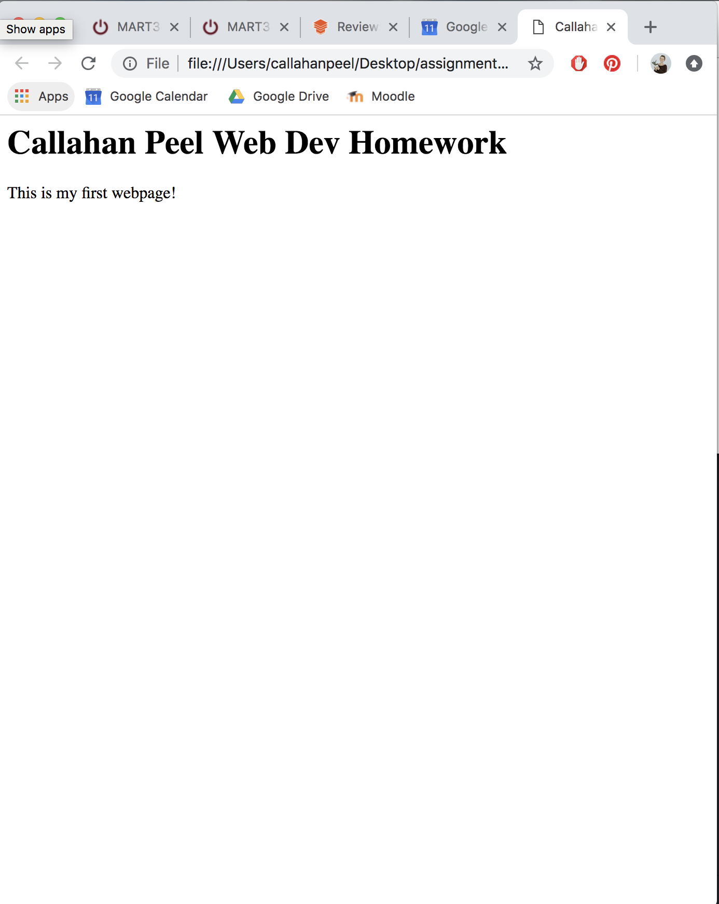

# My Responses:

Web browsers allow clients and web servers to communicate! When you type in an address or URL into your browser (like chrome), your browser is sent a command to the server it uses directly. This command is telling the server to locate the address and display it within your browser. I currently use Chrome and safari to browse.

A markup language is code for formatting the layout and/or style within a text file page. HTML is one commonly used in website development.

